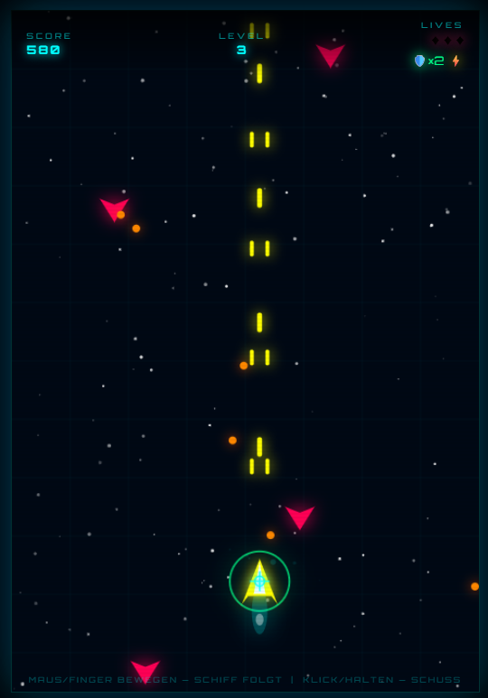

# 🚀 Neon Blaster

Ein Retro-Arcade-Shooter im Neon-Cyberpunk-Look, gebaut mit reinem JavaScript und der Canvas API. Steuere dein Raumschiff, schieße Gegner ab und sammle Power-Ups, um so lange wie möglich zu überleben.

**🔗 Live Demo:** [vampirenoob.github.io/neon-blaster](https://vampirenoob.github.io/neon-blaster/)

## Preview



## Features

- Flüssige Maus- und Touch-Steuerung (Schiff folgt dem Cursor/Finger)
- Drei Gegnertypen mit unterschiedlichem Verhalten (Standard, Zickzack, Tank)
- Ansteigende Schwierigkeit über Level, basierend auf dem Score
- Power-Up-System: 🛡️ Schild (übersteht 2 Treffer) und ⚡ stärkerer Schuss (8 Sekunden doppelter Schaden)
- Partikeleffekte bei Treffern und Explosionen
- Responsive Design, spielbar auf Desktop und Mobile
- Neon-Glow-Ästhetik mit Scanlines und Sternenfeld-Hintergrund

## Tech Stack

- HTML5 Canvas API
- Vanilla JavaScript (kein Framework, keine Libraries)
- CSS3 (Flexbox, Media Queries, Aspect-Ratio)
- Google Fonts (Orbitron)

## Project Structure

```
neon-blaster/
├── index.html          # Spielfeld und UI-Overlay
├── style.css           # Gesamtes Styling, Neon-Effekte
└── script.js           # Spiellogik, Rendering, Power-Ups
```

## Running Locally

```bash
git clone https://github.com/VampireNoob/neon-blaster.git
cd neon-blaster
```

Danach einfach `index.html` im Browser öffnen — kein Build-Prozess oder Server nötig.

## Contact

Feel free to reach out via GitHub or Instagram:
- GitHub: [@VampireNoob](https://github.com/VampireNoob)
- Instagram: [@vampirenoob](https://www.instagram.com/vampirenoob/)